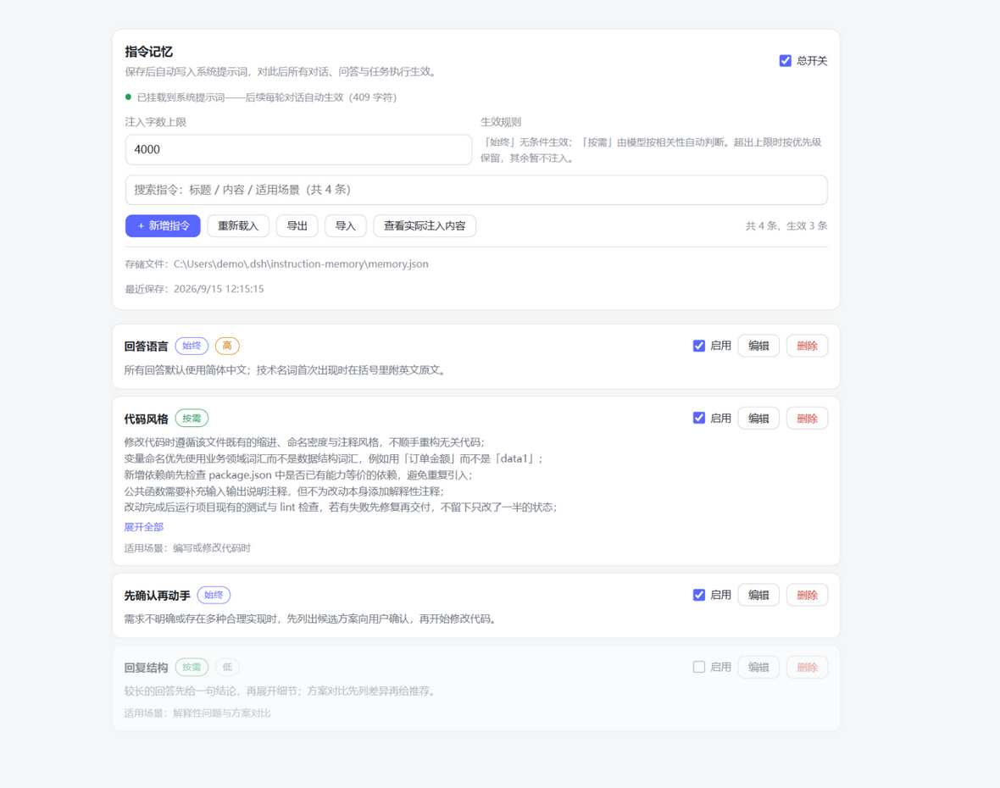

# dsh-instruction-memory

在 DSH 设置界面中维护**长期指令记忆**：保存后自动注入此后每一轮对话的系统提示词。



> 想先看看界面？在 [GitHub 仓库](https://github.com/HERO476/dsh-instruction-memory)中打开 `docs/demo.html`，无需安装 DSH，浏览器直接体验真实设置页（内置演示数据）。

## 安装

```sh
dsh plugin --profile web add dsh-instruction-memory
```

宿主版本必须落在[兼容性](#兼容性)声明的范围内。范围之外**宿主会拒绝安装/启动**（1.0.14 起，
因为 `peerDependencies` 已声明）；确需强行安装可用 `dsh plugin allow-version` 授予该精确版本的
豁免，风险自负。

装完重启 DSH，设置页会出现「指令记忆」入口。卸载：

```sh
dsh plugin --profile web remove dsh-instruction-memory
```

## 只由用户本人维护

**这份记忆的内容只属于用户。** 本插件刻意**不注册任何面向模型的工具**——模型没有任何
途径自行添加、修改或删除记忆条目。写入入口只有设置页（以及用户本人直接编辑存储文件），
因此不会出现 AI 悄悄给用户"记下"指令的情况。

条目内容由用户输入并被原样注入，本插件不对其做语义判断或自动生成。

## 组成

| 文件 | 作用 |
| --- | --- |
| `lib/index.js` | Host 半：读取/保存记忆，注册 `systemPrompt` 段落，暴露同源 JSON 路由 |
| `lib/client.js` | Client 半：在 `settings.section` 注册「指令记忆」设置页（手写模块，无需构建） |
| `cordis.patch.yml` | bundle patch：把 Host 行插入宿主组合 |
| `install.mjs` | 开发安装脚本：从本仓库检出安装时，把包链接进 web profile 的 `node_modules`（junction）并注册 `dsh.profile.bundles`；`--remove` 完整回滚，改 profile 前自动备份 |
| `contract-test.mjs` | 契约测试：驱动真实路由，验证两半之间的响应格式 |
| `verify.mjs` | 装载验证：按 DSH 的方式加载两半 |
| `smoke-test.mjs` | 注入渲染逻辑的单元测试 |
| `host-range-test.mjs` | 宿主版本范围契约测试：固定矩阵 × 两种 semver 判定模式，并把 `peerDependencies`（**被执行的那个**）、`dsh.engines.dsh`、`dsh.compatibility.dsh` 三处声明锁到同一个生成值 |
| `lint.mjs` | 语法门禁：`node --check` 解析所有随包发布与本仓库运行的 JS 文件，已并入 `npm test` |
| `docs/demo.html` | 离线演示页：桩掉 DSH 外壳、加载真实 Client 半渲染设置页（不随 npm 包发布） |

## 生效方式

- **始终** 条目：无条件遵守。
- **按需** 条目：由模型按相关性自行判断是否适用，不相关时忽略；可填「适用场景」辅助判断。
- **优先级** 高 > 普通 > 低，决定注入顺序。
- **注入字数上限**：超出时按优先级保留，被略过的条目数会在注入文本末尾注明。
  上限单位是**字符**而非 token——按 DeepSeek 官方分词比例约 1 个中文字符 ≈ 0.6 token、
  1 个英文字符 ≈ 0.3 token（不同模型分词有差异，实际用量以模型返回为准），上限 40000
  字符约合 24000 token。

条目全部停用或总开关关闭时，该提示词段落**整个注销**，系统提示词与未安装本插件时逐字节一致。

## 存储

记忆保存在 **DSH 数据根目录**下（设置页会显示完整绝对路径）：

```
<DSH_HOME>/instruction-memory/memory.json      # DSH_HOME 默认为 ~/.dsh
```

路径优先级与官方 `@deepseek-ai/dsh-home-paths` 一致：显式 `$DSH_HOME` → `~/.dsh`。
**空白的 `$DSH_HOME` 视为未设置**，绝不会退回当前工作目录——否则用户换个目录启动
DSH 就会得到第二份空记忆，看起来像"记忆消失"。

> 1.0.0 之前的构建曾把数据写在宿主进程 cwd 下（`.dsh-instruction-memory.json`）。
> 首次启动新版本时会自动迁移到上述位置，并把原文件改名为 `*.migrated` 保留。

该文件可手工编辑，保存后已打开的设置页会**自动刷新**（见下文「外部改动自动刷新」）；
流式更新不可用时「重新载入」按钮仍可手动读回。每次保存先写临时文件再原子替换，
进程崩溃不会留下损坏的半截 `memory.json`；保存前把上一版**复制**为 `memory.json.bak`，
若 `memory.json` 解析失败会自动临时回退到该备份并明确提示。

> **备份为什么是"复制"而不是"改名"**：曾经的做法是先把 `memory.json` 改名成 `.bak`、
> 再改名临时文件顶上。这两步之间 `memory.json` 是不存在的——只要第二步失败（文件被占用、
> 磁盘满、杀软扫描），主路径就一直空着，下次启动找不到文件就会**建一份空存储**，用户的
> 记忆看起来凭空消失，而真实数据其实好好躺在 `.bak` 里。改为复制后主文件在原子替换成功
> 前始终待在原位；同时启动时若发现 `memory.json` 缺失而 `.bak` 可用，会**从备份恢复并写回**
> 主路径，而不是从零开始。

### 多实例与多窗口（并发保护）

两个 DSH 进程共享同一 `$DSH_HOME`（如 `web` 与 `tui` profile 同时运行），或两个设置页
窗口同时打开时，数据可能被并发修改。两层保护：

- **跨进程写锁**：每次写盘前创建 `memory.json.lock`（独占创建），写完即删。锁存在超过
  10 秒视为持锁进程已崩溃、直接接管；等待 2 秒仍拿不到锁**不会导致保存失败**——宁可继续
  写入（last-write-wins）也不让用户的保存被卡死。原子替换保证任何交错下文件本身不会损坏。
- **修订号（`rev`）与冲突拒绝**：每次成功写入使 `data.rev` 加一并落盘。客户端的每次修改
  请求都带上它看到的 `rev`（`baseRev`）；若与服务端当前 `rev` 不一致（另一个窗口/进程刚
  提交过），服务端拒绝本次修改并返回**最新快照**，面板自动刷新并提示重试——防止旧窗口
  把别的窗口刚删除的条目"复活"回去。不带 `baseRev` 的旧客户端保持原有行为。

### 外部改动自动刷新（SSE）

设置页打开期间通过 `EventSource` 订阅同一路由上的事件流（GET +
`Accept: text/event-stream`），存储一旦在面板之外发生变化，已打开的面板**自动更新**，
无需手动「重新载入」：

- **触发来源**：其他窗口经同一宿主保存（写盘成功即向所有订阅者推送快照）；`memory.json`
  被外部进程或手工改写（宿主以 `fs.watch` 监听**存储目录**——原子替换在 Windows 上会
  使文件级监听失效——去抖 250ms 后经与写盘相同的队列重读，内容确有变化才重载并推送；
  自己的写入盘后磁盘与内存一致，天然被同一比较抑制，不会回声）。
- **回声抑制**：发起修改的窗口也会收到自己那次写入的推送帧，但帧内容与它已吸收的响应
  快照逐字节相同，客户端按内容比对直接丢弃——否则刚出现的「已保存」提示会被空消息的
  推送帧瞬间冲掉。
- **降级而非报错**：宿主不支持或连接中断时 `EventSource` 按 `retry: 5000` 自动重连，
  重连失败期间面板照常可用（「重新载入」仍是兜底），不会弹出错误。
- 编辑器中未保存的草稿**不受推送影响**；保存时按当前 `rev` 提交，外部若已抢先修改
  会被冲突拒绝拦下。

响应信封中的 `saved` 字段语义为「**本次操作是否把存储写入了磁盘**」，只反映真实写入：
普通读取（`state`/`reload`/`export-data`）一律 `false`；首次运行时 `state` 物化文件、
或 `reload` 触发从 `.bak` 恢复/旧位置迁移这类"载入即写回"的分支才为 `true`。早先版本
对读取操作也回 `true`，使该字段不携带任何信息。

若手工编辑后的文件有条目为空或超过 200 条上限，设置页会明确提示哪些条目未能载入
（它们将在下次保存时从文件中移除），不会静默丢弃。手改的**选项值**同样有披露：`enabled`
写成非布尔值、或 `budgetChars` 超出 800–40000 范围/不是数字时，载入会按规则修正
（回退到 `true` / 夹到边界），并在设置页明确提示**原值 → 修正值**——否则下次保存会把
修正值悄悄写回文件，你以为改过的设置其实从未生效。导入时若某条超出长度上限
（标题 120 / 内容 6000 / 适用场景 200 字符），会明确提示**有几条、哪个字段**被截断，
而不是悄悄改短。文件若声明了**未来的格式版本**（`version` 非 1），插件会拒绝载入并
**暂停一切修改**（此时保存会用 v1 格式覆盖文件，可能损坏数据），直到你升级插件或把
文件改回版本 1 后点「重新载入」。

设置页支持**导出 / 导入**：导出为自带说明的 JSON 文件；导入采用**合并语义**——按 id 与
「标题+内容」去重，只新增、绝不覆盖或清空现有条目。请求体上限由条目上限推导
（`MAX_ENTRIES × (MAX_CONTENT + MAX_TITLE + MAX_WHEN + 200) × 2 + 100000`），保证**本插件
导出的文件一定能被自己导回**——早先写死的 1,000,000 小于满配导出（200 × 6000 = 1.2 M 字符），
导致满配记忆导出后无法导入。

### 首次运行不写文件（惰性创建）

全新安装、尚无任何记忆时，插件**不会**在宿主启动那一刻创建空的 `memory.json`。

> 这里曾主动物化一份空存储，只为让设置页有个真实路径可显示。但那意味着插件在**进程启动、
> 零会话、零任务**的状态下执行了一次磁盘写入——这正是行为审计中唯一能被正当称为
> "没活干还在动"的副作用。现在文件由**第一个真正需要它的动作**创建：一次保存、一次导入，
> 或设置页读取 `state`（面板打开时就会读）。

在这之前：`storage.path` 仍会显示路径，但 `storage.onDisk` 为 `false`，设置页显示
「尚未写入磁盘」（该文案本就存在），`state.injection.registered === false`，`pulls === 0`。
挂载日志相应为 `from=first run (no store on disk yet) onDisk=no`。

**不受影响**：从 `.bak` 恢复、以及从旧位置迁移——这两条分支只有在**磁盘上已有真实数据**时才会走，
它们仍然会立即写回。

## 无 Web 服务器时依然生效

`systemPrompt` 是本插件唯一的硬依赖。**Web 服务器不是前置条件**：设置页那部分路由通过
非阻塞的 `ctx.inject(['webServer'], …)` 子 fiber 注册，服务出现时自动挂上；没有 Web 服务器
的 profile（`headless`、`tui`）里，系统提示词注入照常工作，只是设置页不可用。

> 这里曾声明 `inject = ['systemPrompt', 'webServer']`。声明式依赖是**前置条件**，于是没有
> Web 服务器的 profile 里整行插件永远停在 pending、`apply()` 根本不执行——用户同时失去设置页
> **和**记忆注入，而记忆本身根本不需要 Web 服务器。非阻塞注册同时把最初那个竞态修得更彻底：
> 回调在服务发布时就会执行，而不只是在它"抢在插件挂载之前"发布时才生效。

## 诊断日志

插件此前**只有失败才有输出**：每次载入、保存、注入成功都不留任何记录，只有失败分支走
`console.error`。于是"记忆到底有没有在干活"完全无法从日志回答。现在它挂载时写一行
`info`，过程细节写 `debug`（走宿主的 `ctx.logger`）：

```
[instruction-memory] mounted: store=<DSH_HOME>\instruction-memory\memory.json from=memory.json onDisk=yes entries=2 enabled=true section=437 chars (pending assembly) pulls=0
```

挂载行含**数据来源**（`memory.json` / `memory.json.bak (main file missing)` / `memory.json.bak (main file corrupt)`
/ `legacy cwd file (migrated)` / `first run (no store on disk yet)`）、**是否已在磁盘上**（`onDisk`）、
条目数、总开关状态、段落就绪时的字符数，以及 `pulls`。

### 为什么是 `section=… (pending assembly)` 而不是 `injected=…`

**「段落已就绪」≠「已经注入」。** 注入发生在宿主装配提示词时；插件在挂载那一刻**什么都没注入过**，
打印 `injected=437 chars` 会让人误以为记忆已经进入了某个提示词。这是本插件此前一处会误导排查的措辞。

真正的"到达了提示词"的信号是 **`pulls`**：宿主每次对这段做装配，插件注册的那个 thunk 就被求值一次，
计数器加一。因此

- `pulls=0` = 已准备、**从未装配**（进程刚起来、或会话空闲）；
- `pulls=N` = 已被拉进提示词 N 次。

插件看不到会话或轮次，**不会**报告 `sessions=` 之类的数字——那会是编造。它只报告自己能真正观测到的东西。
`pulls` 同时出现在路由的 `state` 快照里（`injection.pulls`）。每次拉取另有一条 `debug` 行：
`section pulled into a prompt (pull #N)`。

**这是纯日志，绝不影响注入内容**：同一份存储在"有 logger"和"没有 logger"下渲染出的文本
**逐字节相同**（`verify.mjs` 有断言锁定这一点）。`debug` 级别由宿主日志级别过滤；
没有 logger 服务的环境下需要 `DSH_INSTRUCTION_MEMORY_DEBUG=1` 才会输出到标准错误。

## 请求来源防护（Host / Origin）

设置页路由之所以要求 `content-type: application/json`，是因为 HTML 表单无法伪造 JSON body，
而跨源 `fetch` 带 JSON 会先在 preflight 失败。**这两条防线都建立在"浏览器认为这是跨源"之上，
DNS 重绑定恰好推翻了它**：`evil.com` 解析到 `127.0.0.1` 之后，页面与服务器在浏览器眼里是
**同源**——不发 preflight、JSON 也合法，于是任何网页都能改写用户那份"注入到此后每一轮
对话"的长期指令。此时唯一无法伪造的就是浏览器发出的 `Host` 头。

因此当服务器绑定在回环地址（默认）时，路由**要求 `Host` 是回环**，另外校验 `Origin`（若存在）
与 `Host` 同源。命中即 **403**，并记一行日志：

```
[instruction-memory] route rejected a request: Host 头不是回环地址（可能是 DNS 重绑定攻击）：evil.com:8080
```

- 绑定到**任何非回环地址**（`--host 0.0.0.0`、`::` 或具体 IP，即主动对外发布）时 Host 校验**自动关闭**——那种情况下无法预知合法 Host，强行限制只会打断所有正常客户端；`Origin` 校验仍然生效。
- 无 `Host` 的 HTTP/1.1 请求由 Node 的 HTTP 解析器先以 400 拒掉，根本到不了路由。
- 端口不参与 `Origin` 比对（反向代理可能改写端口），主机名才是重绑定攻击的对象。

此外路由还读取 **`Sec-Fetch-Site`**（Fetch Metadata）：现代浏览器给每个请求都打上它，
即使某些技巧（如 `no-cors` fetch）不带 `Origin`，`evil.com` 发来的请求仍会被标记为
`cross-site`——命中即 **403**。仅拒绝 `cross-site`；`same-site` 必须放行（同站判定不看端口，
GUI 与路由本就同主机不同端口），`none`（用户直接导航）放行；curl、Node 与 2020 年前的
老浏览器根本不发这个头，也不受影响（它们由 Host 与 content-type 校验兜底）。

### 经反向代理对外发布（自行承担风险）

默认部署（回环绑定 + 本机浏览器）不需要这一节。若你把 DSH 的 Web 服务器绑定到非回环地址
（`--host 0.0.0.0` 或具体 IP）并置于 nginx / Caddy 等反向代理之后远程访问，需要注意：

**先说清楚代价**：该路由**没有任何鉴权**。一旦发布到网络上，任何能访问它的人都能增删改你
那份"注入到此后每一轮对话"的长期指令。Host 校验在非回环绑定时自动关闭，`Origin` 与
`Sec-Fetch-Site` 只能拦"来自其他网页的请求"，拦不了直接发 HTTP 的攻击者。**更安全的替代
是隧道方案**（SSH 端口转发 / Tailscale / WireGuard）：宿主仍绑定 `127.0.0.1`，远程客户端
通过隧道以回环身份访问，所有校验原样生效。

仍要走反向代理时，代理必须满足：

1. **原样转发 `Host`**（nginx：`proxy_set_header Host $host;`）。GUI 页面与 API 走同一个
   域名时，浏览器发的 `Origin` 与转发的 `Host` 主机名一致，`Origin` 校验通过；改写或剥掉
   `Host` 会得到 403。
2. **不要注入 `Origin`**：代理自己添加的 `Origin` 头若与 `Host` 不同源，会被当作跨源拒绝。
3. **透传 `Sec-Fetch-Site`**：代理不应剥掉 Fetch Metadata 头；正常同站访问浏览器发的是
   `same-origin`，不受影响。
4. **透传 `content-type` 与请求体**：路由只接受 `application/json` 的 POST，
   路径前缀为 `/instruction-memory/api`，代理转发规则需覆盖它。
5. **限制来源**：至少用代理层做 IP 白名单或加 Basic Auth——插件本身不提供任何鉴权。

## 兼容性

同一串范围写在**三处**，而**只有一处会被宿主强制执行**——这一点以前写错过，现在按实测更正：

| 位置 | 谁读它 | 作用 |
| --- | --- | --- |
| **`peerDependencies`**（`@deepseek-ai/dsh-system-prompt`） | **宿主**：`evaluatePluginCompatibility()`（`dsh-app-boot/lib/index.js`），在**安装**与 **profile 启动**时执行 | **真正的门禁**。不满足即拒绝（或要求显式授予精确版本豁免：`dsh plugin allow-version`）。门禁把 peer 的**范围值**与宿主版本（`dsh --version`）比较，peer 的**包名不参与解析**，只用来点名报错 |
| `dsh.engines.dsh` | 插件市场（第三方，服务端读取） | 市场卡片上的兼容性判定与展示 |
| `dsh.compatibility.dsh` | 未找到读取方（官方文档与 DSH 树内均无） | 仅作人类可读的重复声明 |

**1.0.14 之前这里只有后两处，没有 `peerDependencies`**——而宿主的门禁在读到缺失的 `peerDependencies` 时会直接 `return undefined`（`if (!Object.hasOwn(fields, "peerDependencies")) return void 0`），也就是**跳过检查**。换句话说，范围之外的宿主在此之前可以装上而**没有任何拦截或警告**；那串范围当时只是市场元数据，不是门禁。1.0.14 补上 peer 之后，它才真正生效。

同一串范围（三处逐字节一致，由测试锁定）：

```
>=0.1.3-alpha.2 <0.1.4 || >=0.1.4-0 <0.1.5-0 || >=0.1.5-alpha.1 <0.1.6-0 || >=0.1.6-alpha.0 <0.1.7-0 || >=0.1.7-alpha.0 <0.2.0-0 || >=0.2.1-alpha.0 <0.3.0-0 || >=0.2.0-0
```

**验证范围与证据等级**——三者不可混为一谈，下面每一行都标了它到底证明了什么：

| 等级 | 证明什么 | 覆盖 |
| --- | --- | --- |
| ① **真实启动** | 在该宿主版本上真的把 DSH 跑起来：插件装载、注入真的进入**组装后的提示**、插件 HTTP 路由可应答、客户端设置页模块被下发（Windows / Node 22） | `0.1.3-alpha.2` · `0.1.5-alpha.1` · `0.1.5-alpha.2` · `0.1.5-rc.1` · `0.1.5-rc.2` · **`0.2.0-rc.1`** ⁽*⁾ · **`0.2.0-rc.2`** ⁽**⁾ |
| ② **契约核验** | 抓该版本**真实发布的源码**，逐个核验本插件实际用到的每个符号：`systemPrompt.section()`、`assemble()` 是否求值**函数型** `text`、`FILE_REFERENCE=900` / `TOOL_BASH=1000` 仍在（决定 order 950 是否空档）、重名注册是否抛错、`webServer.register()` / `get host()`、`ctx.inject()` / `ctx.effect()`、`dsh.client.inject` 两包在该版本是否存在且声明了 `dsh.client` | 声明范围接住的**全部 15 个已发布版本**（`0.1.3-alpha.2` → `0.2.1-alpha.1`） |
| ③ **真实执行** | 把插件**真的挂载**进该版本的 `@deepseek-ai/cordis`，跑装载 / 路由注册 / 卸载共 9 项断言 | cordis `4.0.2` 与 `4.0.4`（各 9/9） |

⁽*⁾ **`0.2.0-rc.1` 的①档有一条要说明**：插件装载、注入进入组装后的提示、HTTP 路由可应答三项**均已实测**（路由 `HTTP 200`；`injection.registered=true`、`chars=437`、**`pulls=38`**——即 0.2.0-rc.1 的 agent loop 真的求值了 38 次函数型 `text`）。第四项"客户端模块被下发"**没有直接抓取**：首页需要鉴权（`/` 返回 `401`），我无法取到 `window.__DSH_BOOT__`。这一项的支撑是间接但强的两条：① `dsh-client-modules` 在合成阶段对 `dsh.client` 声明做硬校验，不合格会抛 `ClientPackageCompositionError` 直接导致启动失败——宿主正常启动即说明声明通过了 0.2.0-rc.1 的校验；② 本插件用到的三个客户端契约包（`-slots` / `-renderer` / `-settings`）相对升级前真正在跑的 `0.1.7-rc.2` **逐字节未变**。**未做人工视觉确认**（没有打开设置页看）。

⁽**⁾ **`0.2.0-rc.2` 的①档**：桌面版 `0.2.0-rc.2`（私有发行版 `dsh-desktop-runtime`，见仓库 `dsh-memory-verification/DSH-VERSION-COMPAT.md` §12）上完成过路由 200 + `registered=true` + 注入段落真实出现在会话提示中的活体实测；网页版宿主 `0.2.0-rc.2` 上对本插件路由的 `state` 探测同样返回 200。同样**未做设置页人工视觉确认**。

此外 `host-range-test.mjs` 的固定矩阵覆盖 `0.1.6-alpha.2`、`0.1.7-rc.2`、`0.2.0-rc.1`、`0.2.0-rc.2` 与 `0.2.1-alpha.1`，并会**读取本机实际安装的宿主版本**做实时断言。

**关于 1.0.10 新增的 `ctx.inject`。** 这是新版唯一的硬依赖增量：`inject` 去掉了 `webServer`，设置页路由改为非阻塞的 `ctx.inject(['webServer'], …)` 子 fiber（原因见上）。为此逐个核验了 **cordis 全部 7 个已发布版本**（`4.0.1-rc.1` → `4.0.5-alpha.1`）——**每一个都具备 `ctx.inject`**（其中 4.0.2 / 4.0.4 另做了真实挂载执行，4.0.5-alpha.1 为源码符号核验），因此声明范围内不存在因它而失效的宿主版本。

**关于声明范围是否"超范围承诺"。** 已对全部 **30 个**已发布宿主版本穷举核验（2026-10-05，npm 官方 registry）：范围内 **15 个**版本的 API 面**全部齐备，超范围承诺 0 项**，且默认与 `includePrerelease` 两种语义在这 15 个版本上零分歧。范围外的 15 个版本（`0.0.1-rc.1` → `0.1.2-rc.1`）API 面**同样齐备**，但它们**从未真实启动验证过**，所以下限维持不动、不向外放宽——不把没验证过的东西写进声明。

**关于 `0.2.1-alpha.1`（2026-10-03 发布，1.0.16 起覆盖）。** 它是前述"未来 minor 预发布版本在默认语义下接不住"的**第一个真实发生案例**：1.0.15 的范围在宿主门禁与市场判定（均用 `includePrerelease`）下放行它，但在 npm/pnpm 默认 peer 解析下拒绝（ERESOLVE）；其耦合面（9 个契约点）经最近 10 版本矩阵核验全部齐备，cordis 为 `4.0.5-alpha.1`。1.0.16 新增 `>=0.2.1-alpha.0 <0.3.0-0` 枚举段后两种语义一致放行。**该版本仅有契约层证据，未做真机启动实测。**

**`0.2.0-rc.1` 的核验口径**（2026-09-29 增补）：基准取 npm 上**真实发布的 `0.1.7-rc.2`**（升级前本机真正在跑的版本），逐文件 SHA256 与 `0.2.0-rc.1` 比对。本插件的 6 个耦合点里 **6 个逐字节未变**（`dsh-system-prompt` 4/4、`dsh-client-ui-slots` 4/4、`-renderer` 12/12、`-settings` 11/11、`dsh-host-webserver` 3/3、`dsh-client-modules` 10/10）；变动的只有 `dsh-agent-loop`（注入通路 `preStep` / `assemble` 逐行等同）与 `dsh-app-boot`（兼容门禁函数逐字节等同）。方法带**阴性对照**：同法比对 `0.1.6-alpha.2` 得到的哈希**不同**，证明这套比对确实能检出变化，而不是恒真。

**一个运维上值得知道的事实。** 早期 DSH 用 caret 范围声明同族依赖（如 `^0.1.5-alpha.2`），范围会随时间"往前漂"：**今天**安装旧版 DSH，npm 在 `includePrerelease` 语义下会把同族子包解析到**当前最新的 `0.1.x`**，而不是当年那份（实测 7/10 个采样版本会漂移，3 个因精确锁定不会）。这不影响本插件的结论——漂移目标同样在已核验范围内——但"今天装出来的树"与"当年装出来的树"可能不同。

**为什么写成分段形式**：node-semver 规定"候选版本带预发布标签时，区间里必须存在同一个
major.minor.patch 且自身带预发布标签的比较符"。这条规则是**集合级**的——一个 `||` 分支最多
覆盖**一个** minor 的预发布版本。由此产生两个必须遵守的约束：

- **宽写法接不住预发布**：`>=0.1.3-alpha.2`、`>=0.1.3-alpha.2 <0.2.0-0` 都**匹配不到**
  `0.1.4-0` / `0.1.5-rc.1` / `0.1.6-alpha.2`——因为 `0.1.3` 与 `0.2.0` 的 tuple 都不等于
  它们各自的 tuple（已用 node-semver 7.8.5 实测确认）。
- **每段的上界不能省**：省略会被上一段的比较符"续接"。例如单写 `>=0.1.5-alpha.1`（不封顶），
  在把 `0.1.3` 当 token 时会放行 `0.1.3-alpha.0/1`。

⚠️ **一个必须知道的上限（注意它是"模式相关"的，别当成普适结论）：未声明的未来 minor 的预发布版本，在 npm 的默认语义下无法被任何范围覆盖。**
`0.1.8-rc.1` 这类版本 tuple 与所有比较符都不同，在 **npm 默认语义**下**永远匹配不到**——与
`^0.1.0` 无法匹配 `0.1.8-rc.1` 是同一个限制。正式版（`0.1.8`、`0.2.0`、`1.0.0` 等）不受影响。
这个限制不再只是假设：**`0.2.1-alpha.1`（2026-10-03 发布）就是第一个真实撞上它的版本**，
1.0.16 已通过新增 `0.2.1` 枚举段闭合；下一个未声明 tuple（如 `0.2.2-rc.1`、`0.3.0-rc.1`）
仍会重演同一现象，需要发一版加一行——host-range 的实时守卫会在本机升级到该宿主时
直接让测试失败并给出可直接套用的修复行。

**但在 `includePrerelease: true` 下这条上限不成立。** 实测同一串范围：`0.1.8-rc.1` 在默认语义下 `false`、
在 `includePrerelease: true` 下 **`true`**（已用 DSH 自带的 semver 7.8.5 验证）。而这个区别是**有后果**的，
因为两条消费路径用的模式不同：

| 消费方 | 模式 | `0.1.8-rc.1` 会被放行吗 |
| --- | --- | --- |
| npm / pnpm 解析 `peerDependencies`（**包管理器**） | 默认 | **否** |
| **宿主门禁** `evaluatePluginCompatibility` | **`includePrerelease: true`**（`dsh-app-boot` L300） | **是** |
| 插件市场（第三方，服务端） | `includePrerelease: true` | **是** |

也就是说：对**包管理器**而言那个上限成立，对**宿主门禁**而言它其实已经被宽松模式接住了。
所以"未声明的新 minor 预发布版会不会被拒"**不能只看一句话**，要问清楚是哪种模式。
（`host-range-test.mjs` 里那条 `0.1.8-rc.1 is unreachable` 的断言取的是**默认模式**，其用例名
因此容易被误读成普适结论——这一点已在 1.0.14 的核验里记录。）

**这个限制无法用代码消除，但它的后果已经被消掉了。** 范围现在是**生成出来的**：
`host-range-test.mjs` 顶部的 `COVERED_LINES` 是唯一事实来源，package.json 里那串长字符串必须
逐字节等于由它生成的结果（有专门的漂移断言），所以手改长串导致"枚举漏了一段"这类错误不可能
再发生——DSH 发新 minor 时只需在列表末尾加一行。

同时**实时守卫**（直接读本机实际安装的宿主版本）在发现未覆盖的宿主时，会打印**精确到行**的
修复配方，并且在打印前**先验证该配方真的能让那个版本被放行**：

```
FAIL  LIVE GUARD: the installed host 0.1.8-rc.1 is admitted by both modes  -> ...
      Fix: append { floor: '0.1.8-alpha.0', below: '0.2.0-0' } to COVERED_LINES
           and set the preceding line's below to '0.1.8-0'
      [verified: that edit admits 0.1.8-rc.1]
```

这份配方本身也有测试：`host-range-test.mjs` 会拿 `0.1.8-rc.1` 走一遍"确认当前范围拒收 →
套用配方 → 确认放行 → 确认下方版本仍被拒收 → 确认所有已覆盖版本仍被放行"。配方失效会先失败在
测试里，而不是失败在用户的安装上。

**历史修复说明**（同一个 bug 出现过两次，值得记下来）：

- 1.0.7 及以前，范围末段是 `>=0.1.5-alpha.1`，使宿主 `0.1.6-alpha.2` 在 npm **默认**语义下
  被判为**不兼容**（预发布门禁要求 tuple 相同：`0.1.5 ≠ 0.1.6`，`>=` 的大小比较根本走不到）。
- 1.0.8 改为逐段枚举，但只枚举到 `0.1.6`。DSH 随后发布 `0.1.7-rc.2`，**同一个假阴性再次出现**：
  范围里最后一个预发布 tuple 是 `0.1.6`，而 `0.1.7 ≠ 0.1.6`。1.0.9 补上 `0.1.7` 段。
- 1.0.10 把枚举抽成 `COVERED_LINES` 单一事实来源 + 漂移/可达/递增断言，并让实时守卫给出
  **自验证**的修复配方——这个 bug 的**成因**（手改长串）从此被消掉。

两次都因为插件市场传入 `includePrerelease: true` 而侥幸放行，但任何标准 semver 判定
（`npm` / `pnpm` 的依赖解析）都会拒绝。现在 `host-range-test.mjs` 同时具备固定矩阵与实时守卫。

**未验证范围**：macOS / Linux、`headless` 与 `tui` profile，以及**除上表等级①那几个之外的任何版本的真实启动**，均未实测。
等级②只证明"该版本里有这些 API"，**不证明端到端可用**。

**关于"市场读哪个字段"这条的证据等级。** 这里说的是**插件市场（第三方）**的行为，不是 `dsh` 自身：
市场从已发布的 npm manifest 读 `engines.dsh`（顶层优先）或 `dsh.engines.dsh`，与 `@deepseek-ai/dsh*` 的
`peerDependencies`（若有）**求交**，再用 `semver` + `includePrerelease: true` 与宿主版本比较，据此在卡片上
显示兼容性；`dsh.compatibility.dsh` **不是**市场读取的那个字段。

需要如实说明它的**来源等级**：这一条**在官方文档里没有**，树内也没有可核验的市场客户端
（`dshmarket` / `alldsh` 均为第三方，读取发生在服务端）。它的依据是一份独立的第三方实证记录
——本机安装的 `dsh-vibe-math@2.3.16` 在其 `dsh.compatNote` 里逐字写明了上述读取路径与"自用的
`dsh.compatibility.dshReleases` 市场不读"。所以请把它当作**第三方实证**，不要当成官方保证。
（1.0.14 之前这段把它与官方事实并列陈述，措辞已按证据分级修正。）

**范围之外的宿主会发生什么（1.0.14 起变了）。** 在此之前，本插件没有 `peerDependencies`，宿主门禁
直接跳过检查，范围外宿主**可以装上且没有警告**。1.0.14 起 peer 生效：

- **宿主**（`dsh plugin add` / profile 启动）会拒绝，除非用户显式授予该精确版本的豁免
  （`dsh plugin allow-version`），这正是 DSH 设计的正常流程；
- **市场**会把"确认不兼容"的条目隐藏并拒绝安装/更新（"未声明"或"无法确认"的条目照常显示）。

`host-range-test.mjs` 会断言 `peerDependencies` 与另外两处字段**逐字节一致**，并断言 peer 只声明这一个包名——
三处任一被手改都会在测试里失败。

## 发布（维护者）

**正规流程是推 tag，由 CI 通过 OIDC（Trusted Publishing）发布**，不需要任何长期令牌：

```sh
# 1. 自检（prepublishOnly 也会自动跑；占位符未替换会中止发布）
npm test
node check-metadata.mjs
# 2. 升版本并提交
#    package.json 的 version 必须与 tag 完全一致，否则工作流会拒绝发布
git commit -am "1.0.N: ..."
git push origin main
# 3. 打 tag 推送 → 触发 .github/workflows/publish.yml
git tag -a v1.0.N -m "1.0.N: ..."
git push origin v1.0.N
```

工作流会先跑 `npm test` 与"tag ↔ version 一致"校验，再 `npm publish --access public`；
公开仓库 + OIDC 会自动附带 **provenance 存证**。

**npm 侧的一次性配置（发布前必须完成，且 npm 不会校验你填了什么）**：
Package → Settings → Trusted publishing → Add trusted publisher

| 字段 | 值 |
| --- | --- |
| Organization or user | `HERO476` |
| Repository | `dsh-instruction-memory` |
| Workflow filename | `publish.yml`（**只写文件名**，须完全一致） |
| Environment name | （留空） |
| Allowed actions | 勾选 **npm publish** |

> ⚠️ 2026-09-03 之后创建的 trusted publisher **默认只允许 `npm stage publish`**，直发必须显式勾选。
> 字段填错不会在保存时报错，只会在**第一次发布尝试**时以 `ENEEDAUTH` 之类的错误暴露。

**这就是本仓库 1.0.10 / 1.0.11 / 1.0.12 由本地 `npm publish` 发布的原因**：这三版发布时该配置尚未就绪，
`Publish` 工作流的唯一失败步骤正是 `npm publish`（其余步骤含 `npm test` 全部通过），因此那三版**没有 provenance**、也没有对应的 git tag。
**不要为这三个版本补推 tag** —— 版本已被占用，重跑只会再得到一次必红的 CI。从下一个新版本起走上面的正规流程。

**本地兜底发布**（仅在 OIDC 不可用时）：`npm login` 后直接 `npm publish --access public`。
本机若已有 `~/.npmrc` 令牌即可直接发布，但产物**不含 provenance**。

## 数据格式

```json
{
  "version": 1,
  "rev": 3,
  "enabled": true,
  "budgetChars": 4000,
  "entries": [
    {
      "id": "im-xxxx",
      "title": "回答语言",
      "content": "所有回答使用简体中文。",
      "mode": "always",
      "when": "",
      "priority": 1,
      "enabled": true,
      "updatedAt": 1700000000000
    }
  ]
}
```

`mode` 为 `always` | `auto`；`priority` 为 `2` 高 / `1` 普通 / `0` 低。`rev` 是存储修订号，
由插件在每次成功写入时递增，**无需手填**（缺失视为 0）。
